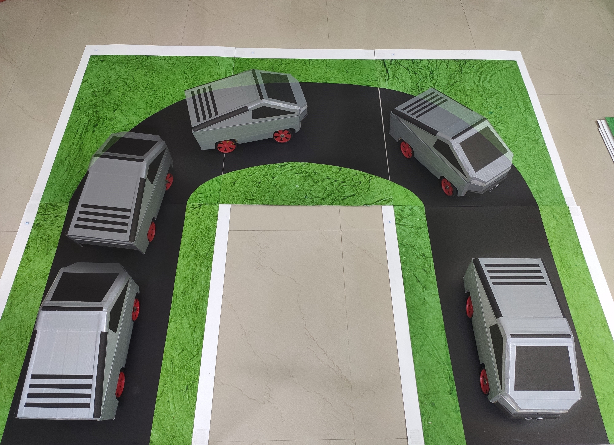

# The GHOST CAR - An Autonomous Car Project
## Academic Final Year Engineering Project

* The Aim of this project was to develop a Autonomous Car Prototype, which had automatic steering control, traffic sign recognition, traffic light detection and other object detection features.  
* The Project runs on a Model Car which uses a Raspberry Pi 4B+, assisted by 1-3 external computing hardware based on the GPU memory capacity. The Model Car collects input from a camera module, an ultrasonic sensor, sends data to a external computer over IP. The computer processes the input data for movement controls, object detection (traffic sign and traffic light) and collision avoidance.  
* All these features are achieved using latest technologies such as, Machine Learning Algorithms, Artificial Neural Networks, Sensor Fusion and Computer Vision.  

## THE GHOST CAR - PROTOTYPE

## About the Project Files Structure

**Driving Prediction**  
* &emsp; The following Programs are run on an external system with good GPU computation capacity.  
* &emsp; &emsp; `angle.txt`: File buffer for TCP data transfer.  
* &emsp; &emsp; `modelall.h5`: Trained model file to control the Steering for the Prototype Car.  
* &emsp; &emsp; `modelleft.h5`: Trained model file to control the Steering for the Prototype Car - only left turns.  
* &emsp; &emsp; `modelright.h5`: Trained model file to control the Steering for the Prototype Car - only right turns.  
* &emsp; &emsp; `run.bat`: Batch File to manage multiple windows.  
* &emsp; &emsp; `uploadTCP.py`: Establishes TCP connection to the prototype car.  
* &emsp; &emsp; `videoPredict.py`: Program that predicts steering angle using trained Convolution Neural Networks.  
* &emsp; &emsp; `videoPredict.py`: Program that predicts steering angle using trained Convolution Neural Networks.  
* &emsp; For DataSet used to train the following model refer to my other repository - [GhostCar-TrainingData](https://github.com/sgagankumar/GhostCar-TrainingData)  
* &emsp; For Training Procedures and Techniques refer to my other repository - [GhostCar-Training](https://github.com/sgagankumar/GhostCar-Training)  
  
**Lane Detection**  
&emsp; &emsp; `lanesImage.py`: Detects Lanes on Road - for Image Input.  
&emsp; &emsp; `lanesTuner.py`: Helps in tuning lanesImage.py  
&emsp; &emsp; `lanesVideo.py`: Detects Lanes on Road - for Video Input.  
&emsp; &emsp; `test_images.jpg`: Samples Images to test lanesImage.py  
&emsp; &emsp; `test_video.mp4`: Samples Videos to test lanesVideo.py  
  
**Object Detection**  
&emsp; &emsp; `coco.names`: COCO is a large-scale object detection, segmentation, and captioning dataset, to know more you can visit [Click Me](https://cocodataset.org/#home) .  
&emsp; &emsp; `OD.py`: Object Detection Program - for Video Input.  
&emsp; &emsp; `ODimage.py`: Object Detection Program - for Image Input.  
&emsp; &emsp; `test.mp4`: Sample Video for Testing Object Detection.  
&emsp; &emsp; `yolov3(380).cfg`: Yolov3 config files.  
&emsp; &emsp; `yolov3(608).cfg`: Yolov3 config files - Standard.  
&emsp; &emsp; `yolov3-tiny.cfg`: Yolov3 tiny config files - Light weight.  
&emsp; &emsp; `yolov3.weights`: Yolov3 tiny neural networks weights files - Standard.  
&emsp; &emsp; `yolov3-tiny.weights`: Yolov3 tiny neural networks weights files - Light weight.  
&emsp; ~ Yolov3 Config and Weight files obtained from [Yolo](https://pjreddie.com/darknet/yolo/) by [Joseph Chet Redmon](https://pjreddie.com/)  
  
**RPi Programs**  
&emsp; The following programs are run on the Raspberri Pi mounted on the Car Prototype.  
&emsp; &emsp; `GhostCarDrive.py`: Program that controls the Prototype Car's components for the autonomous driving.  
&emsp; &emsp; `IPStreaming.py`: Program that streams car's camera input to external computer over IP.  
&emsp; &emsp; `SampleControlServoMotor.py`: Sample program to test Servo Motors manually.  
&emsp; &emsp; `SampleTestMotor.py`: Sample program to test DC motor through L298N driver.  

**Sample TCP Connection**  
&emsp; &emsp; `client.py`: Sample TCP Client Program - Runs on RPi to establish connection with External GPU.  
&emsp; &emsp; `server.py`: Sample TCP Server Program - Runs on laptop to send back data to RPi.  

**Simulation Testing Driver**  
&emsp; &emsp; `drive relay.py`: Program that connects with UDACITY Autonomous Driving Simulator.  
&emsp; &emsp; `drive.py`: Program to test trained models on the simulator.  
&emsp; &emsp; `model speed.h5`: Trained Model to control the Car's Speed.  
&emsp; &emsp; `model steering.h5`: Trained Model to control the Car's Steering.  
&emsp; &emsp; `model throttle.h5`: Trained Model to control the Car's Throttle.  

**Trafic Light Detection**  
&emsp; &emsp; `TrafficLight.py`: Program that recognises Traffic Lights.  
&emsp; &emsp; `Sample_Video.mp4`: Sample video to test Traffic light Recognition.  
&emsp; &emsp; `Sample_Output.mp4`: Sample video output for the Traffic light Recognition.  

**Traffic Sign Detection**  
&emsp; &emsp; `Traffic Signs Detection.py`: Program to Predcit Traffic signs - for Video Input.  
&emsp; &emsp; `trafficmodel.h5`: CNN model for traffic sign prediction.  
&emsp; For DataSet and Training Procedures used to train the following model refer to my other repository - [ML-Traffic-Sign-Classification](https://github.com/sgagankumar/ML-Traffic-Sign-Classification)  

**Udacity Simulator**  
&emsp; &emsp; `Udacity Simulator - Windows64 - Installer.zip`: Windows Installer for Open Source Simulation Software developed by UDACITY using Unity Engine for Autonomous Car Simulation. For the Actual Project Refer the following link. https://github.com/udacity/self-driving-car-sim  

**Video Recording**  
&emsp; &emsp; `videoCapture.py`: Program to record video from a camera or mp4 or mjpeg stream.  
&emsp; &emsp; `videoFlipper.py`: Program that flip the video horizontally or vertically to alter different positions of camera.  
&emsp; &emsp; `videoFramer.py`: Program that saves each frame in a Separate folder for a Video Input also with a config file with all the frame files names, usually used for dataset generation.  
	
## Setting up the environment  
### On Raspberry Pi  
The hardware used in this project on the prototype was a Raspberry Pi 4 B+ 4GB RAM Model.  
1. Install `Python 3.6.0+`  
2. Copy the 'RPi Programs' folder onto the Raspberri Pi directory.  
3. Run the following commmand on your terminal `pip3 install -r Requirements.txt`  

### On External System  
The external hardware used in this project consists of two laptops. Each running Steering Control and Object Detection Respectively  
1. Install `Python 3.6.0+`  
2. Copy all the project file system.  
3. Run the following commmand on your terminal `pip install -r Requirements.txt`  

## How to drive  
1. **Testing:** Run the Sample programs under each sub-folder to test the functioning for all the features.  
  
2. **Training (optional):** Run the training programs along with relevant dataset to customize the neural network models as per requirements  
  
3. **Actuation:** Test all the hardware components and use the Pin Configuration table to connect all the components on the model prototype.  
  
4. **Camera Input over IP Stream:** Run `python3 IPStreaming.py` on RPi4 and check for output on web browser at www.[YourRPiIP]:[PortNumber]/index.html NOTE:"Make sure to use a dedicated RaspberriPi Camera Module"  
  
5. **Steering Control Prediction:** Run `python videoPredict.py` on External System to start steering control prediction using CNN.  
  
6. **Establish TCP Communication:** Create a TCP Server connection to send back valuable data to the prototype model. Run `python uploadTCP.py` to start a server to send data upon request from the RPi.  
  
7. **Self-driving of prototype**: Run `python3 GhostCarDrive.py` on RPi4, wait for the program to perform GPIO pin setup and establish a connection with the TCP server. Once the above actions are performed the car with start self-driving.  
&emsp; &emsp; **NOTE**: To terminate the Program - Press *Ctrl + C* only once!, pressing multiple times with forcefully terminate the program causing GPIO pins to misbehave due improper program termination.  

## PROTOTYPE MODEL -
### IMAGES

### VIDEOS

